# Creating a URDF

This tutorial demonstrates how to create a URDF (Unified Robot Description Format) file for the previous quadcopter model.
URDF is an XML format used to describe the link structure and mass characteristics of a rigid multi-link system.
We'll use a CAD model to generate the URDF, detailing each component like the frame, battery, and propellers.

## URDF Overview

---

Here's the URDF we'll be creating:

```xml
<robot name="f450">
  <material name="material_-492512390">
    <color rgba="1 1 1 0.7" />
  </material>
  <material name="material_-496767138">
    <color rgba="0 0 1 0.7" />
  </material>
  <material name="material_-510938680">
    <color rgba="0 0 0 0.7" />
  </material>
  <link name="battery">
    <inertial>
      <mass value="0.186" />
      <origin xyz="0 0 0" rpy="0 -0 0" />
      <inertia ixx="0.000294655" ixy="0" ixz="0" iyy="0.00184636" iyz="0" izz="0.00193145" />
    </inertial>
    <visual>
      <origin xyz="0 0 0" rpy="0 -0 0" />
      <geometry>
        <box size="0.106 0.035 0.026" />
      </geometry>
      <material name="material_-496767138">
        <color rgba="0 0 1 0.7" />
      </material>
    </visual>
    <collision>
      <origin xyz="0 0 0" rpy="0 -0 0" />
      <geometry>
        <box size="0.106 0.035 0.026" />
      </geometry>
    </collision>
  </link>
  <link name="frame">
    <inertial>
      <mass value="0.635" />
      <origin xyz="0.001573 -0.000596 -0.003436" rpy="0 -0 0" />
      <inertia ixx="0.009613" ixy="6e-06" ixz="4.8e-05" iyy="0.009072" iyz="4e-06" izz="0.01867" />
    </inertial>
    <visual>
      <origin xyz="0 0 0" rpy="0 -0 0" />
      <geometry>
        <mesh filename="file:///home/dohi/Downloads/frame.stl" scale="0.001 0.001 0.001" />
      </geometry>
      <material name="material_-510938680">
        <color rgba="0 0 0 0.7" />
      </material>
    </visual>
    <collision>
      <origin xyz="0 0 -0.008" rpy="0 -0 0" />
      <geometry>
        <box size="0.35 0.35 0.1" />
      </geometry>
    </collision>
  </link>
  <link name="propeller1">
    <inertial>
      <mass value="0.012" />
      <origin xyz="0 0 0.004" rpy="0 -0 0" />
      <inertia ixx="0.00046975" ixy="0" ixz="0" iyy="0.00046975" iyz="0" izz="9.375e-05" />
    </inertial>
    <visual>
      <origin xyz="0 0 0" rpy="0 -0 0" />
      <geometry>
        <mesh filename="file:///home/dohi/Downloads/phantom3_0945_ccw.stl" scale="0.001 0.001 0.001" />
      </geometry>
      <material name="material_-492512390">
        <color rgba="1 1 1 0.7" />
      </material>
    </visual>
    <collision>
      <origin xyz="0 0 0.004" rpy="0 -0 0" />
      <geometry>
        <cylinder radius="0.125" length="0.01" />
      </geometry>
    </collision>
  </link>
  <link name="propeller1_1">
    <inertial>
      <mass value="0.012" />
      <origin xyz="0 0 0.004" rpy="0 -0 0" />
      <inertia ixx="0.00046975" ixy="0" ixz="0" iyy="0.00046975" iyz="0" izz="9.375e-05" />
    </inertial>
    <visual>
      <origin xyz="0 0 0" rpy="0 -0 0" />
      <geometry>
        <mesh filename="file:///home/dohi/Downloads/phantom3_0945_ccw.stl" scale="0.001 0.001 0.001" />
      </geometry>
      <material name="material_-492512390">
        <color rgba="1 1 1 0.7" />
      </material>
    </visual>
    <collision>
      <origin xyz="0 0 0.004" rpy="0 -0 0" />
      <geometry>
        <cylinder radius="0.125" length="0.01" />
      </geometry>
    </collision>
  </link>
  <link name="propeller1_2">
    <inertial>
      <mass value="0.012" />
      <origin xyz="0 0 0.004" rpy="0 -0 0" />
      <inertia ixx="0.00046975" ixy="0" ixz="0" iyy="0.00046975" iyz="0" izz="9.375e-05" />
    </inertial>
    <visual>
      <origin xyz="0 0 0" rpy="0 -0 0" />
      <geometry>
        <mesh filename="file:///home/dohi/Downloads/phantom3_0945_cw.stl" scale="0.001 0.001 0.001" />
      </geometry>
      <material name="material_-492512390">
        <color rgba="1 1 1 0.7" />
      </material>
    </visual>
    <collision>
      <origin xyz="0 0 0.004" rpy="0 -0 0" />
      <geometry>
        <cylinder radius="0.125" length="0.01" />
      </geometry>
    </collision>
  </link>
  <link name="propeller1_3">
    <inertial>
      <mass value="0.012" />
      <origin xyz="0 0 0.004" rpy="0 -0 0" />
      <inertia ixx="0.00046975" ixy="0" ixz="0" iyy="0.00046975" iyz="0" izz="9.375e-05" />
    </inertial>
    <visual>
      <origin xyz="0 0 0" rpy="0 -0 0" />
      <geometry>
        <mesh filename="file:///home/dohi/Downloads/phantom3_0945_cw.stl" scale="0.001 0.001 0.001" />
      </geometry>
      <material name="material_-492512390">
        <color rgba="1 1 1 0.7" />
      </material>
    </visual>
    <collision>
      <origin xyz="0 0 0.004" rpy="0 -0 0" />
      <geometry>
        <cylinder radius="0.125" length="0.01" />
      </geometry>
    </collision>
  </link>
  <link name="root" />
  <joint name="battery_joint" type="fixed">
    <origin xyz="-0.035 0 -0.024" rpy="0 -0 0" />
    <axis xyz="0 0 0" />
    <parent link="frame" />
    <child link="battery" />
  </joint>
  <joint name="frame_joint" type="fixed">
    <origin xyz="0 0 0" rpy="0 -0 0" />
    <axis xyz="0 0 0" />
    <parent link="root" />
    <child link="frame" />
    <limit effort="0" velocity="0" lower="0" upper="0" />
  </joint>
  <joint name="propeller1_joint" type="continuous">
    <origin xyz="0.16 -0.16 0.024" rpy="0 0 -0.7854" />
    <axis xyz="0 0 1" />
    <parent link="frame" />
    <child link="propeller1" />
  </joint>
  <joint name="propeller1_joint_1" type="continuous">
    <origin xyz="-0.16 0.16 0.024" rpy="0 0 -0.7854" />
    <axis xyz="0 0 1" />
    <parent link="frame" />
    <child link="propeller1_1" />
  </joint>
  <joint name="propeller1_joint_2" type="continuous">
    <origin xyz="0.16 0.16 0.024" rpy="0 -0 0.7854" />
    <axis xyz="0 0 1" />
    <parent link="frame" />
    <child link="propeller1_2" />
  </joint>
  <joint name="propeller1_joint_3" type="continuous">
    <origin xyz="-0.16 -0.16 0.024" rpy="0 -0 0.7854" />
    <axis xyz="0 0 1" />
    <parent link="frame" />
    <child link="propeller1_3" />
  </joint>
</robot>
```

This URDF defines various elements like materials, links (such as the frame, battery, and propellers),
and the joints that connect these links.

## Launching URDF Builder

---

Instead of manually editing the URDF in a text editor, we'll use URDF Builder, a GUI tool that simplifies URDF creation.
To launch it, use the following command in the terminal:

```bash
$ roslaunch urdf_builder urdf_builder.launch
```

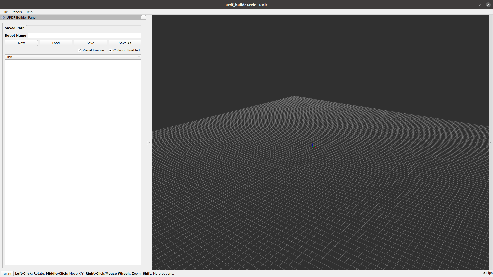

## Creating a New URDF

To begin creating a new URDF, click on the `New` button.
This action will automatically add a link named `root` to the link tree.
If you need to work on an existing URDF, use the `Load` button to load and edit it,
but we won't be using this feature in this tutorial.

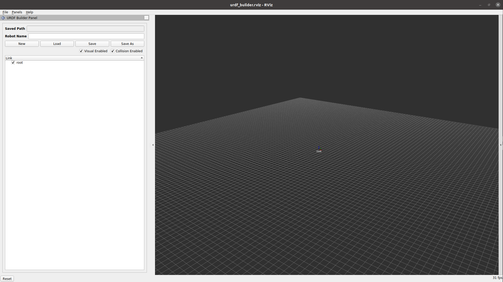

Start by naming your robot in the `Robot Name` field, located at the top left corner of the interface.
In this tutorial, we'll name it `f450`.

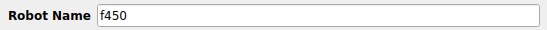

## Setting Up the Frame Link

---

Right-click on the link tree and choose `Add Link` to bring up a new dialog window.
Here, enter `frame` for the `Link Name`, `frame_joint` for the `Joint Name`, choose `root` as the `Parent`, and then click `OK`.
The `frame` link will now be added to the tree.

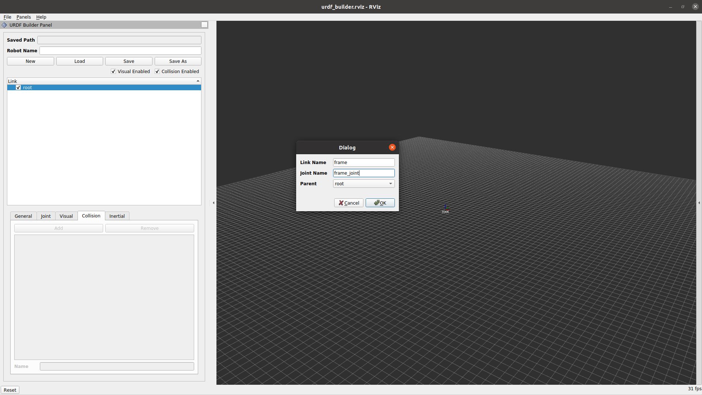

Next, configure the `frame` link by clicking on it in the tree, which will open its settings on the bottom left.

Under the `General` tab, you'll see the link name you previously set.

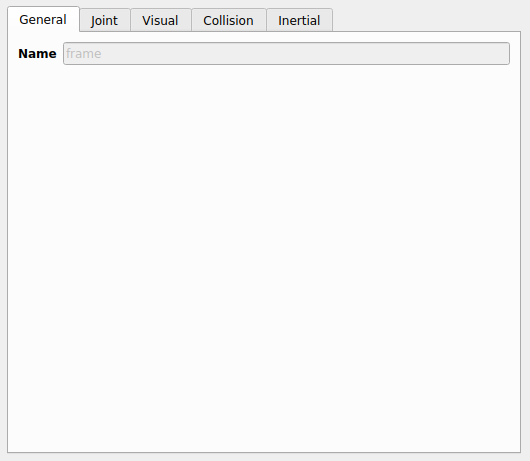

In the `Joint` tab, enter the joint settings.
The `Name` field should already display the joint name you entered earlier.
For `Parent`, the `root` link should be selected since `frame` is a fixed reference link attached to `root`.
Set the `Type` to `Fixed` and keep the `Origin` at its default value zero.

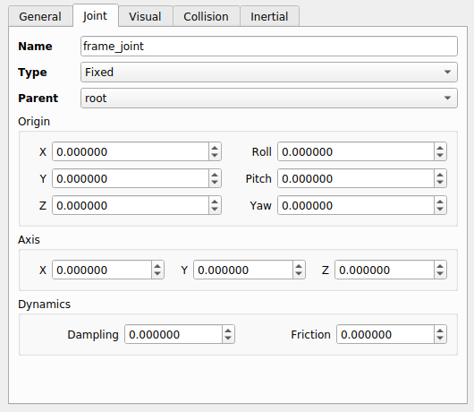

Proceed to the `Visual` tab to define the link's appearance.
Add a visual object by clicking the `Add` button.
Typically, one visual object is sufficient.
Given that the CAD model was aligned with the NWU coordinate system, the `Origin` should remain unchanged.
If your CAD model's coordinate system is different, you may need to adjust it here.
Choose `Mesh` for the `Geometry` type and select the frame's mesh file via the `Browse` button in the `Path` field.
This action will render the model in the interface.
Remember, URDF uses the SI unit system (meters), while Fusion 360 may use millimeters,
so the model might appear 1000 times larger than its actual size.
To correct this, set the `Scale` to 0.001.
For the Material, set the color or texture;
in this case, we'll choose black ((R, G, B) = (0, 0, 0)) to contrast with the white propellers.

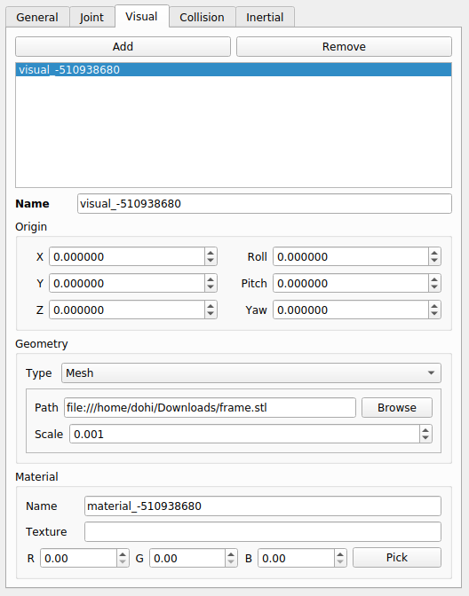
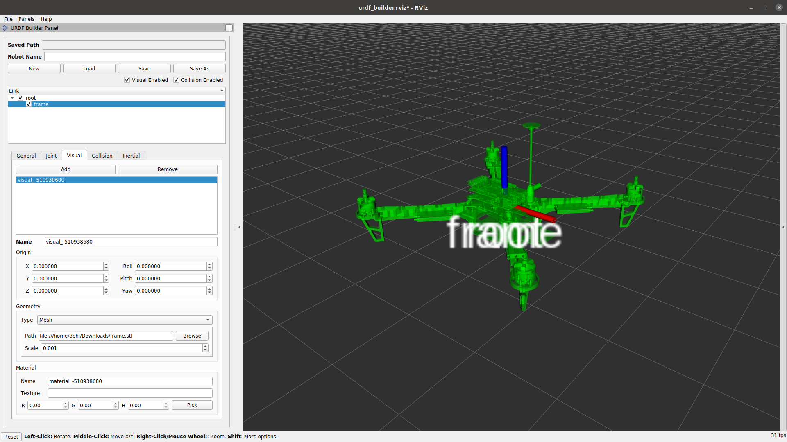

In the `Collision` tab, define the link's collision detection area by adding a collision object.
Similar to Visual objects, multiple Collisions can be combined.
For this, choose `Box` as the `Geometry` type.
While `Mesh` is an option, it can lead to unstable calculations or heavy processing,
so it's better to approximate complex shapes with simpler forms unless necessary.
Adjust the Box to just cover the visual object, as shown in the images.

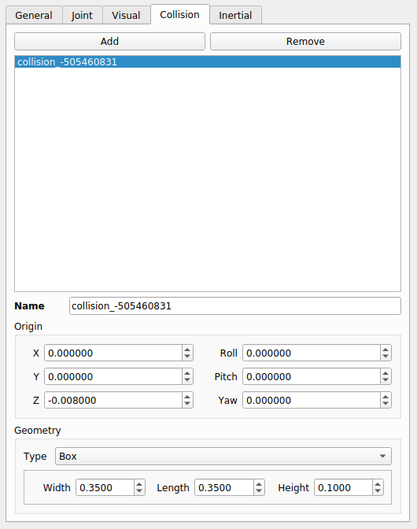
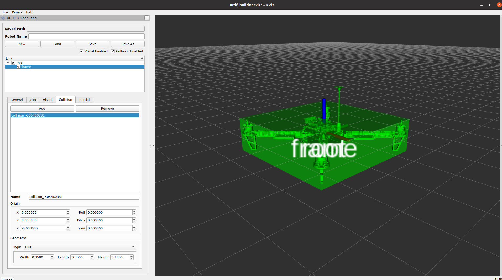

For the `Inertial` tab, set the link's mass properties.
Enter the center of mass in `Origin`, the link's mass in `Mass`, and the inertia tensor components in `Inertia`.
If your CAD model aligns with the NWU coordinate system, you can directly transfer the values from the CAD properties.
If there's a misalignment with the CAD coordinate system, you'll need to adjust here.
Note that unlike the Visual tab, the Inertial settings are not visually represented, so it's harder to verify alignment. Also, remember that all measurements should be in the SI system (meters, kilograms, kg\*m^2).

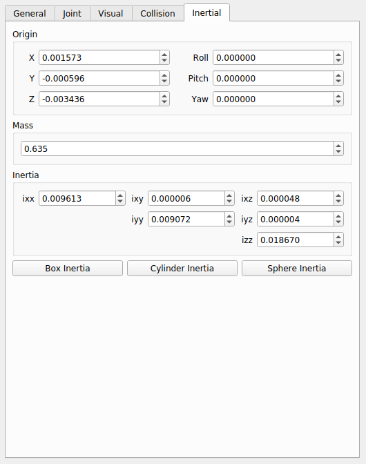

## Setting Up the Battery Link

---

Add the battery link by selecting `Add Link`.
Name the link `battery`, the joint `battery_joint`, and set its parent to `frame`.

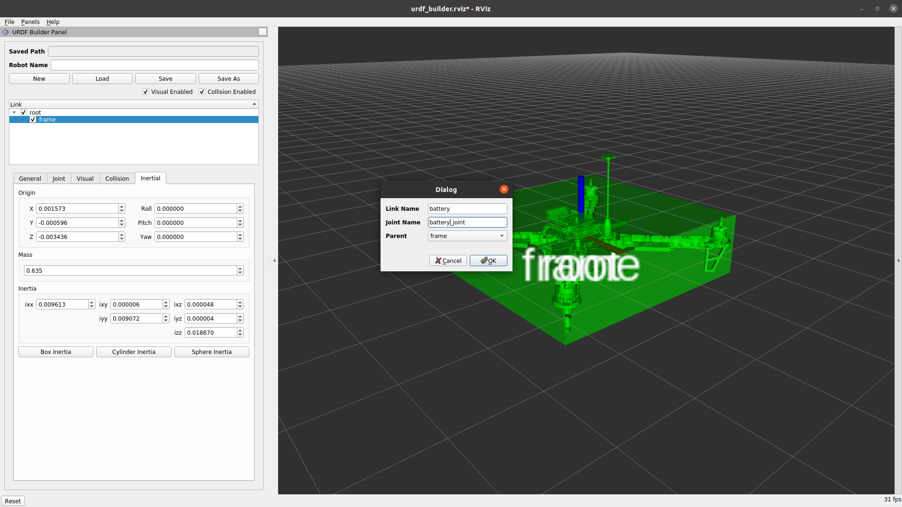

It's helpful to set up the visual aspect first when editing the `Joint` tab, so open the `Visual` tab first.
Add a visual object by clicking `Add`.
Leave the `Origin` as default.
Given that LiPo batteries are typically rectangular, choose Box for the Geometry type instead of a mesh file.
Enter the actual dimensions of the battery in `Length`, `Width`, `Height`.
For `Material`, select blue ((R, G, B) = (0, 0, 1)), reflecting the battery's predominant color.

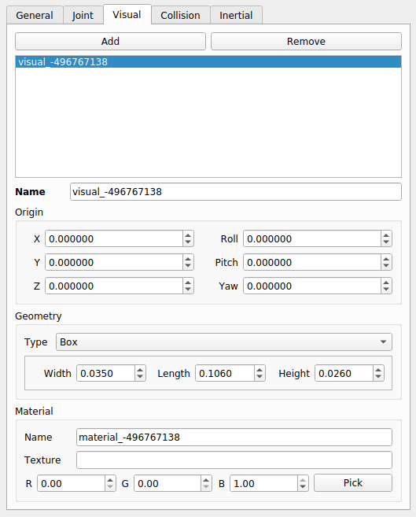
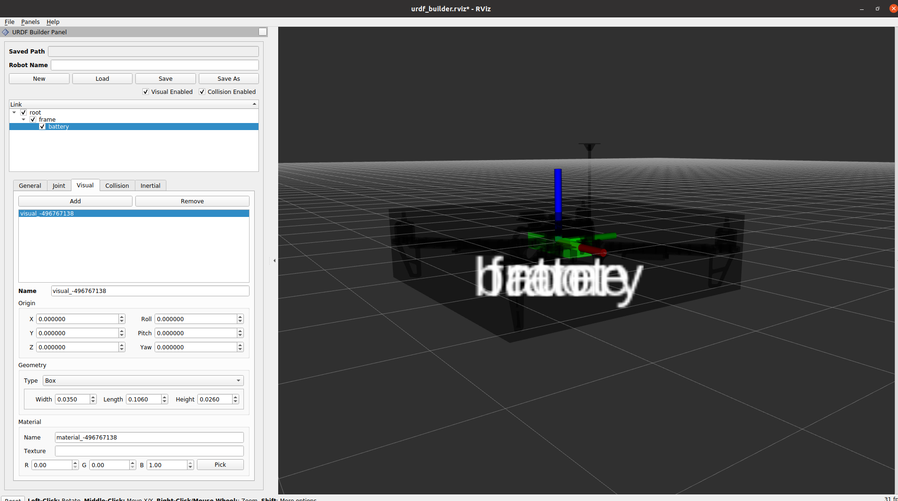

In the `Joint` tab, set up the joint details.
Since the battery is fixed to the frame link, choose `Fixed` for `Type`.
Adjust the `Origin` based on the model view to ensure proper alignment.

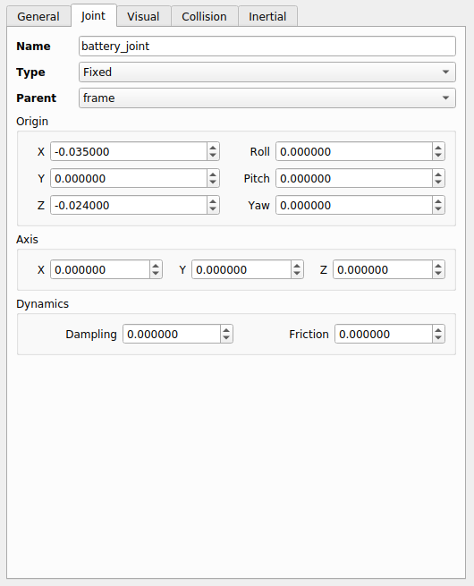
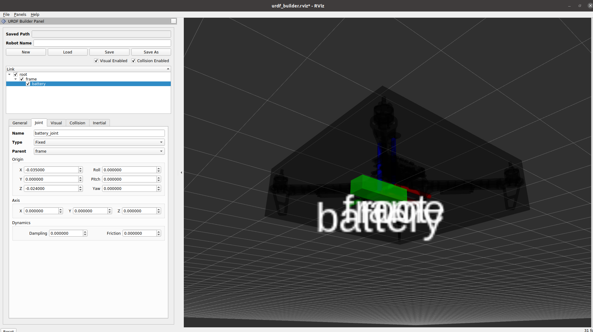

Move to the `Collision` tab to define the battery link's collision detection area.
Click `Add` to insert a collision object.
Set the `Origin` and `Geometry` to match exactly with those defined in the `Visual` tab.

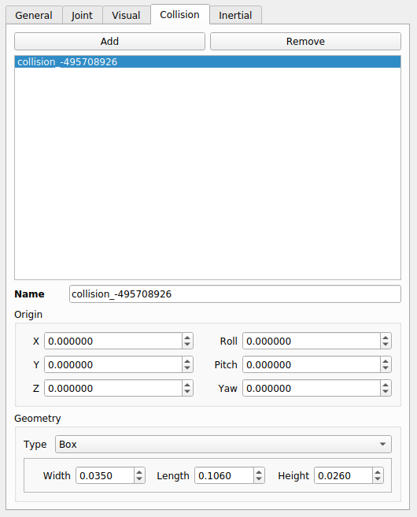

In the `Inertial` tab, establish the mass properties of the link.
You can approximate the battery's mass properties using a rectangular prism shape.
Since the center of mass aligns with the joint origin, set all `Origin` elements to 0.
Enter the battery's weight in `Mass`.
When you click on `Box Inertia` under `Inertia`, a dialog will appear where you input the `Length`, `Width`, `Height`,
and the inertia tensor for the rectangular prism will be calculated and displayed in the tab.
Note that `iyy` and `izz` will be larger than `ixx`, which is consistent with the shape.

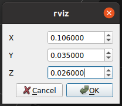
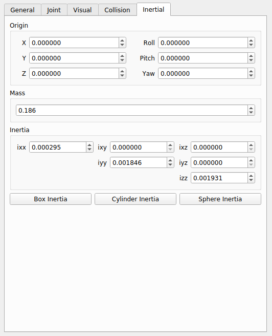

Using only primitive shapes like this to define links is effective, especially during the prototyping phase.
This parametric description allows for easy modifications and should be utilized whenever possible.

## Setting Up the Propeller Link

---

Add a propeller link by selecting `Add Link`.
Name this link `propeller1`, the joint `propeller1_joint`, and set its parent to `frame`.

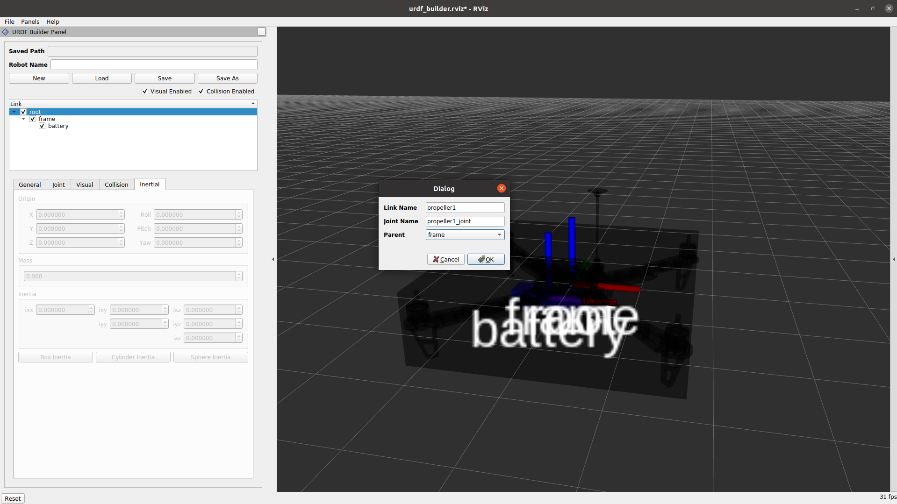

In the `Visual` tab, add a visual object by clicking `Add`.
Keep the `Origin` at its default setting.
Select `Mesh` for the `Geometry` type and specify the `Path`.
Adjust the `Scale` if necessary and set the `Material` to white ((R, G, B) = (1, 1, 1)), to match the actual propeller's color.

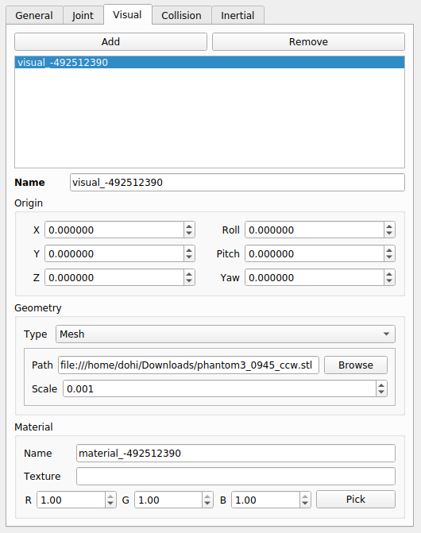

In the `Joint` tab, configure the joint settings.
Since the propeller rotates infinitely relative to the frame, select `Continuous` as the `Type`.
Adjust the `Origin` as you view the model, ensuring proper placement.
Since the propeller's rotation axis is the Z-axis, set the `Axis` to (X, Y, Z) = (0, 0, 1).

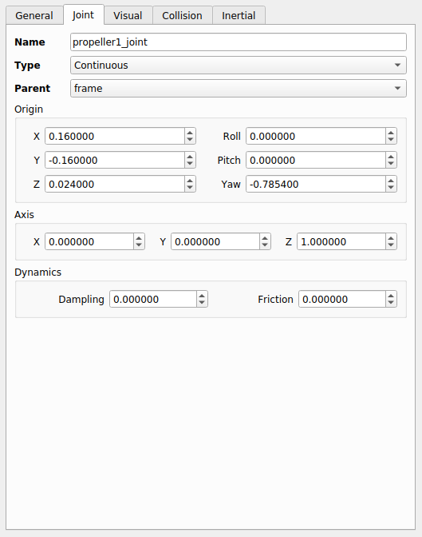
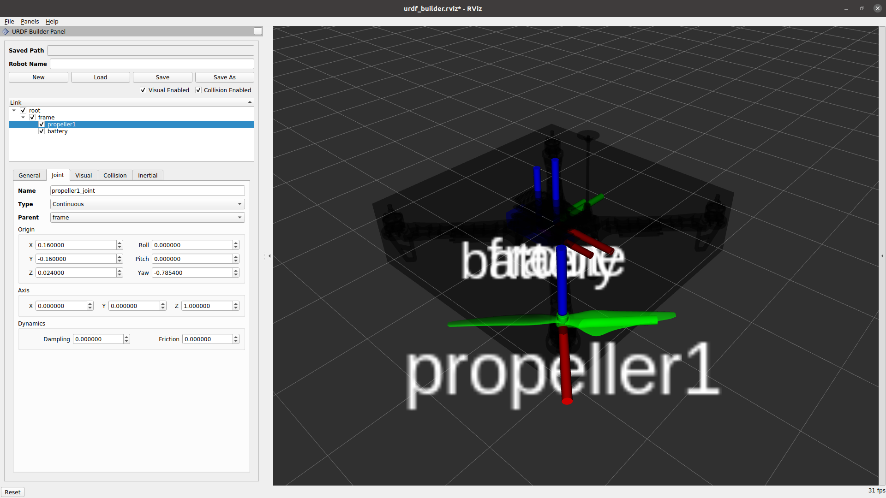

In the `Collision` tab, set the link's collision detection area.
Add a collision object by pressing `Add`.
Choose `Cylinder` for the `Geometry` type and adjust the `Origin`, `Radius`, and `Length`
so that the cylinder just covers the visual object.

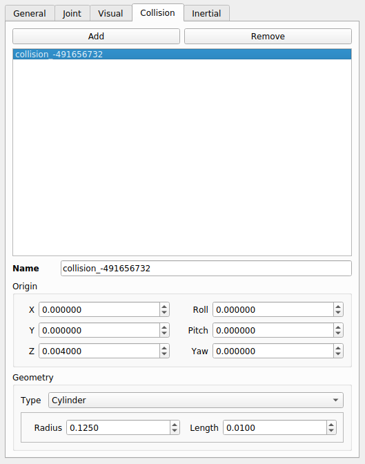
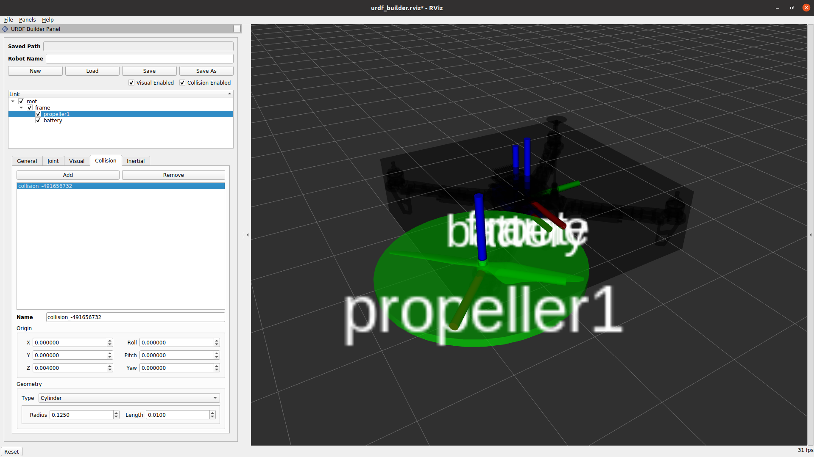

For the `Inertial` tab, approximate the mass properties with a cylinder, similar to the collision settings.
Set the `Origin` to match the collision settings, enter the propeller's mass in `Mass`,
and click on `Cylinder Inertia` under `Inertia` to open a dialog.
Enter the `Radius` and `Length` from the collision settings to reflect the inertia tensor of the cylinder in the tab.
You'll notice that `ixx` and `iyy` are larger compared to `izz`, which aligns with expectations.

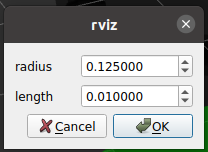
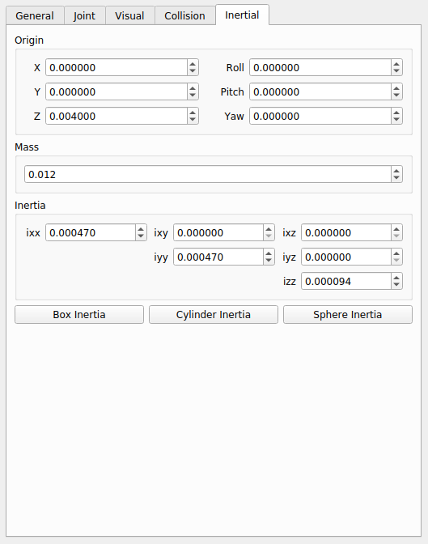

Since the design includes four propellers, and their configurations are largely identical,
cloning `propeller1` is an efficient approach.
To do this, right-click on `propeller1` in the link tree and select `Clone Link`.
This action creates a copy named `propeller1_1`, which is identical to the original except for the link and joint names.
The main differences between the propellers are in the signs of the joint origin and the mesh file in the `Visual` tab.
Modify the `Origin` in the `Joint` tab of `propeller1_1` to reflect these differences,
and update the `Path` in the `Visual` tab's `Geometry` settings.
Repeat this process to add the remaining two propellers, resulting in a complete setup of all four propellers.

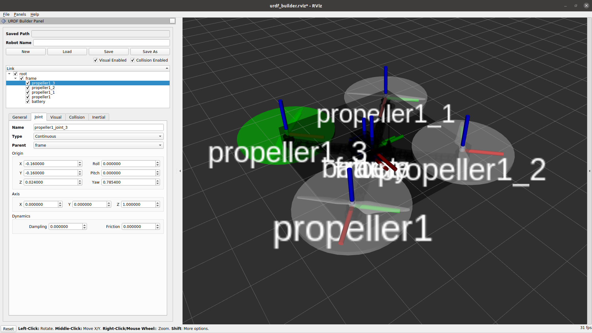

## Saving the URDF

---

To save your work, click either the `Save` or `Save As` button.
A dialog box will appear for you to enter a suitable file name.
After naming your file, click the `Save` button to store the URDF.
With your URDF successfully saved, you can then close the URDF Builder.

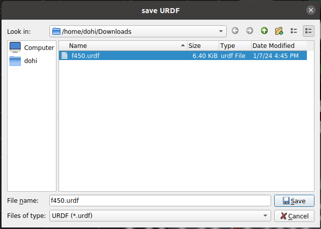
