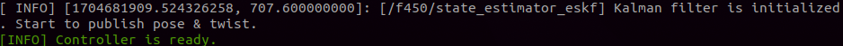
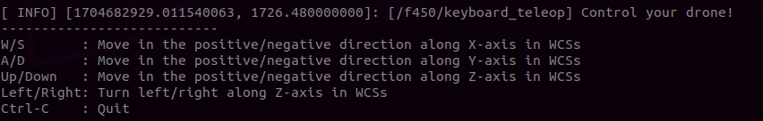
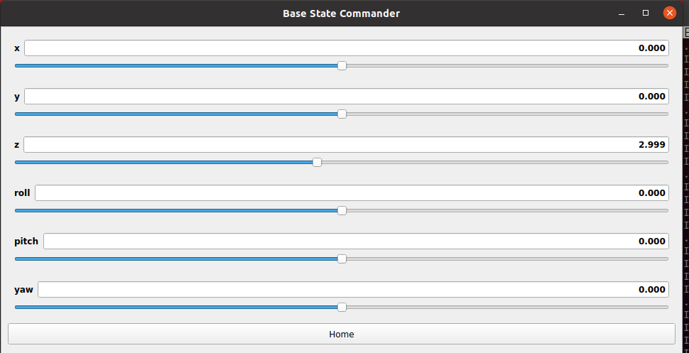
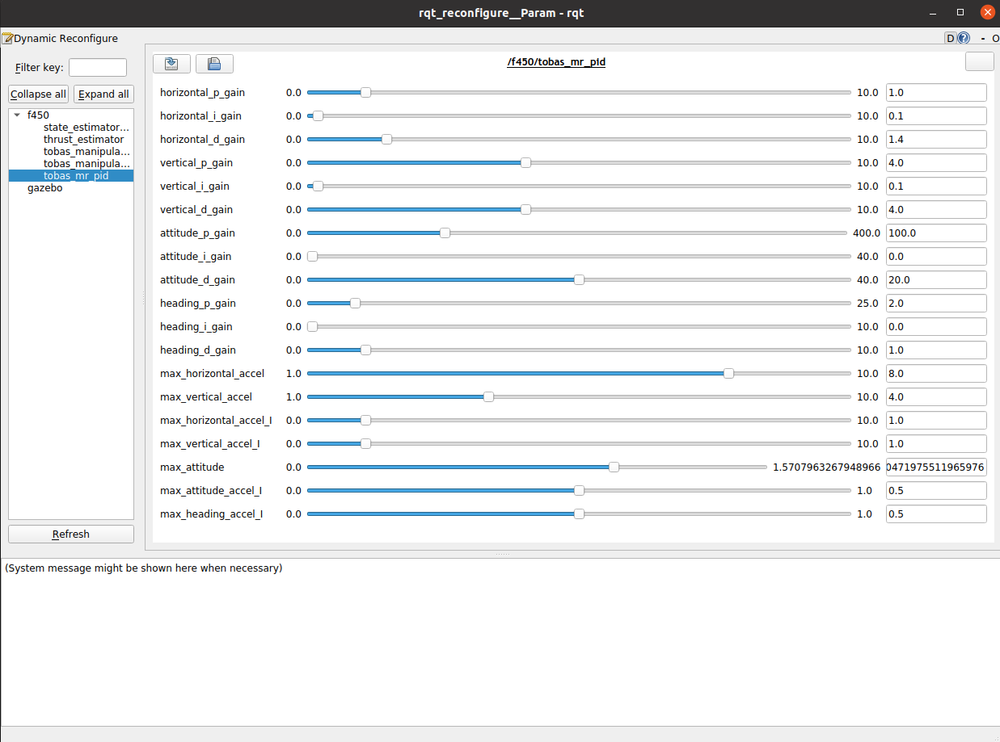

# Gazebo Simulation

To simulate the drone using the Tobas package you created earlier, follow these steps:

## Preliminary Setup

---

Load the catkin workspace environment variables into the current shell:

```bash
$ source ~/catkin_ws/devel/setup.bash
```

This command needs to be executed every time you open a terminal (or add a new terminal page).
To avoid this manual step, you can automate it by writing this command to your `~/.bashrc`:

```bash
$ echo "source ~/catkin_ws/devel/setup.bash" >> ~/.bashrc
```

## Launch Gazebo Simulation

---

Start the simulation with the following command:

```bash
$ roslaunch tobas_f450_config gazebo.launch
```

The modeled drone will be placed at the origin.


## Launch Tobas Software

---

Launch the main software components such as the controller and sensor systems with this command:

```bash
$ roslaunch tobas_f450_config bringup.launch
```

Once you see a green `[INFO] Controller is ready` message, the drone is ready for flight, and you can operate it using ROS API.



## Teleoperation

---

### Operation via Keyboard

You can operate the drone using your PC's keyboard.
Execute the following command:

```bash
$ roslaunch tobas_f450_config keyboard_teleop.launch
```

The drone in Gazebo will take off and hover at a certain altitude.
Instructions for operation will be displayed in the terminal,
and you can control the drone's position by pressing keys while the terminal is focused.



### Operation via GUI

You can also operate the drone using a GUI.
Shutdown the previous keyboard_teleop.launch with Ctrl + C, and then run this command:

```bash
$ roslaunch tobas_f450_config gui_teleop.launch

```

You can control the drone's position by moving the bars.
As this is a rotorcraft, you can only control `x`, `y`, `z`, and `yaw`. Direct control of `roll` and `pitch` is not possible.



### Operation using ROS API

You can also send commands to the drone using ROS API.
This is useful when creating applications, as it allows access to drone information from a user's program.
For more details, see [ROS API](ros_api.md).

First, create a ROS package for placing your drone operation scripts.

```bash
$ cd ~/catkin_ws/src/
$ catkin_create_pkg my_tobas_example
```

After creating your ROS package, proceed with the following steps:

```bash
$ catkin build my_tobas_example
$ source ~/catkin_ws/devel/setup.bash
```

This will build your new package and load it into your shell environment.
Next, you will create a script within your ROS package.
Here's an example of a Python script that uses the `takeoff_action` action for takeoff
and the `command/pos_vel_acc_yaw` topic for position commands.
Please place this script under the my_tobas_example/scripts/ directory.

```python
#!/usr/bin/env python3

import rospy
import actionlib

from tobas_msgs.msg import TakeoffAction, TakeoffGoal, TakeoffResult, PosVelAccYaw

ALTITUDE = 3.0  # [m]
SIDE_LENGTH = 5.0  # [m]
INTERVAL = 5.0  # [s]


if __name__ == "__main__":
    # Initialize ROS node.
    rospy.init_node("command_square_trajectory")

    # Create a takeoff action crient.
    takeoff_client = actionlib.SimpleActionClient("takeoff_action", TakeoffAction)

    # Wait for action server.
    takeoff_client.wait_for_server()

    # Create an action goal.
    takeoff_goal = TakeoffGoal()
    takeoff_goal.target_altitude = ALTITUDE
    takeoff_goal.target_duration = INTERVAL

    # Send the action goal.
    takeoff_client.send_goal_and_wait(takeoff_goal)

    # Get the action result.
    takeoff_result: TakeoffResult = takeoff_client.get_result()
    if takeoff_result.error_code < 0:
        rospy.logerr("Takeoff action failed.")
        rospy.signal_shutdown()

    # Create a command publisher.
    command_pub = rospy.Publisher("command/pos_vel_acc_yaw", PosVelAccYaw, queue_size=1)

    # Continue to command the coordinates of the vertices of the square.
    while not rospy.is_shutdown():
        # Vertice 1
        command = PosVelAccYaw()
        command.pos.x = SIDE_LENGTH / 2
        command.pos.y = SIDE_LENGTH / 2
        command.pos.z = ALTITUDE
        command_pub.publish(command)
        rospy.sleep(INTERVAL)

        # Vertice 2
        command = PosVelAccYaw()
        command.pos.x = -SIDE_LENGTH / 2
        command.pos.y = SIDE_LENGTH / 2
        command.pos.z = ALTITUDE
        command_pub.publish(command)
        rospy.sleep(INTERVAL)

        # Vertice 3
        command = PosVelAccYaw()
        command.pos.x = -SIDE_LENGTH / 2
        command.pos.y = -SIDE_LENGTH / 2
        command.pos.z = ALTITUDE
        command_pub.publish(command)
        rospy.sleep(INTERVAL)

        # Vertice 4
        command = PosVelAccYaw()
        command.pos.x = SIDE_LENGTH / 2
        command.pos.y = -SIDE_LENGTH / 2
        command.pos.z = ALTITUDE
        command_pub.publish(command)
        rospy.sleep(INTERVAL)
```

Grant execution permission to the script.

```bash
$ chmod u+x ~/catkin_ws/src/my_tobas_example/scripts/command_square_trajectory_node.py
```

When the script is executed, the drone will take off and continue moving along the edges of a square.
Since the topic exists within the drone's namespace (set as `Robot Name` during URDF creation), specify the namespace `__ns`.

```bash
$ rosrun my_tobas_example command_square_trajectory_node.py __ns:=f450
```

## Parameter Tuning

---

If necessary, parameters can be adjusted online during flight.
Launch the adjustment GUI with the following command:

```bash
$ rosrun rqt_reconfigure rqt_reconfigure
```



All adjustable parameters will be displayed and can be adjusted using sliders, editors, etc.
Hovering the cursor over the parameter name will display a description of the parameter.
For more details, please visit<a href=https://wiki.ros.org/rqt_reconfigure>rqt_reconfigure | ROS</a>.
