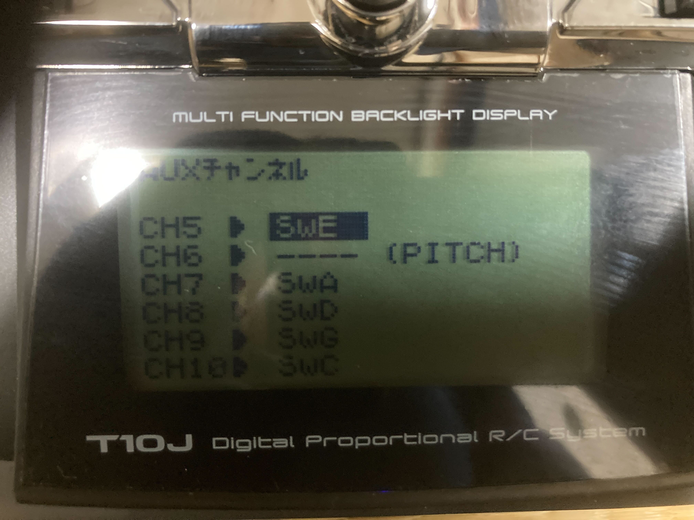
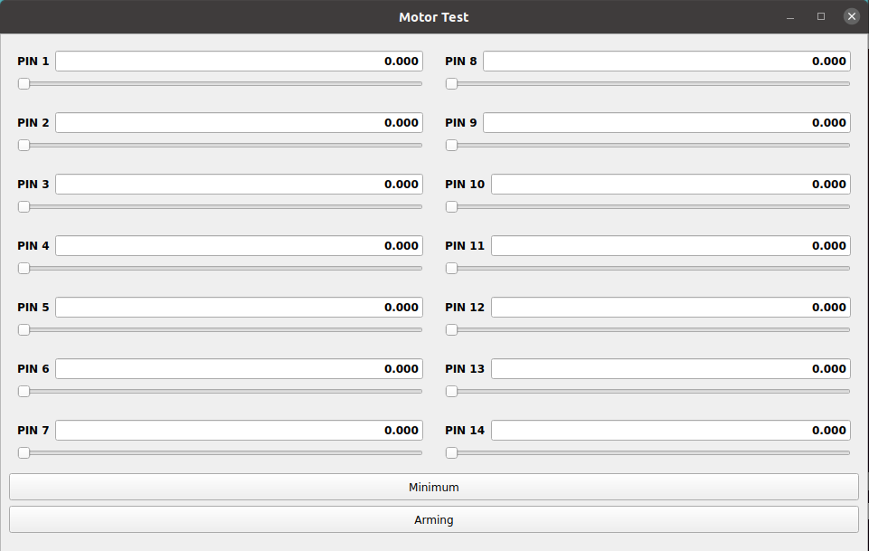

# Hardware Setup

Now that the simulation has been successfully completed, I will proceed with setting up the actual hardware.

## Build the Real Drone

---

Refer to the following sites for building the real drone:

- <a href=https://docs.emlid.com/navio2/hardware-setup target="_blank">Hardware setup | Navio2</a>
- <a href=https://docs.emlid.com/navio2/ardupilot/typical-setup-schemes target="_blank">Typical setup schemes | Navio2</a>

 

Please pay attention to the following points during the build:

### Ensure Motor Rotation Direction Matches Setup Assistant Settings

The motor rotation direction can be checked in `tobas_f450_config/config/f450.tbsf` under `rotor_x/direction`.
Ensure that the motors are installed with the correct rotation direction as specified in `rotor_x/link_name`.

### Ensure ESC Pin Numbers Match Setup Assistant Settings

The ESC pin numbers can be checked in `tobas_f450_config/config/f450.tbsf` under `rotor_x/pin`.
Make sure these numbers match the pin numbers on the Navio2.

### Vibration Damping

To reduce the impact of propeller vibrations on the sensors, implement physical vibration damping measures.
For instance, you can 3D print and use an
<a href=https://docs.emlid.com/navio2/hardware-setup/#anti-vibration-mount>Anti-vibration mount | Navio2</a>.

## Network Configuration

---

Connect the Raspberry Pi to a display, keyboard, and mouse, then power it on. Log in using the initial password `raspberry`.

Enter your network's SSID and password in `/boot/wpa_supplicant.conf`.
Define one or more `network` blocks as follows, with `ssid` being the SSID and `psk` the password.
The network with the higher `priority` is preferred when multiple networks are available.

```txt
country=GB
ctrl_interface=DIR=/var/run/wpa_supplicant GROUP=netdev
update_config=1

network={
  ssid="ssid_of_wifi"
  psk="password_of_wifi"
  key_mgmt=WPA-PSK
  priority=0
}

network={
  ssid="ssid_of_mobile_router"
  psk="password_of_mobile_router"
  key_mgmt=WPA-PSK
  priority=1
}
```

In this example, WiFi is the first choice, and a mobile router
(e.g., <a href=https://www.aterm.jp/product/atermstation/product/mobile/mr05ln/ target="_blank">NEC MR05LN</a>)
is the second, useful for outdoor or non-WiFi environments.

After rebooting, the Raspberry Pi will automatically connect to the network.
You no longer need the display, keyboard, and mouse for the Raspberry Pi.

## SSH Connection to Raspberry Pi

---

Execute the following command on your PC to establish an SSH connection to the Raspberry Pi:

```bash
user@pc $ ssh pi@navio
```

The password is the same as before, `raspberry`. This allows you to remotely operate the Raspberry Pi.

## Sending Tobas Package to Raspberry Pi

---

Send the Tobas package created with the Tobas Setup Assistant to the Raspberry Pi using SSH.
Execute the following command on an external PC:

```bash
user@pc $ scp -r ~/catkin_ws/src/tobas_f450_config pi@navio:~/catkin_ws/src/
```

Build the Tobas package on the Raspberry Pi:

```bash
pi@navio $ cd ~/catkin_ws/
pi@navio $ catkin build tobas_f450_config
```

## RC Transmitter Configuration

---

S.BUS signals assume 8 channels.
The meanings of each RC input channel are as follows:

| Channel | Meaning        |
| :------ | :------------- |
| CH1     | Roll           |
| CH2     | Pitch          |
| CH3     | Thrust         |
| CH4     | Yaw            |
| CH5     | Flight Mode    |
| CH6     | ---            |
| CH7     | Emergency Stop |
| CH8     | GPSw           |

GPSw (General Purpose Switch) is a versatile switch that can be used for purposes
such as switching flight modes in non-planar rotor configuration multirotors.

For the T10J, channels 1 to 4 are fixed as per the table,
and levers corresponding to channels 5 and beyond can be assigned to AUX channels.
Here is how it was set up:



## Calibration

---

Calibrate sensors and other components.
Execute the following on an external PC connected to the Raspberry Pi via SSH.

### Accelerometer

Execute the following and follow the console instructions:

```bash
pi@navio $ ~/tobas/lib/tobas_real/accel_calibration
```

### Magnetometer

Execute the following and follow the console instructions:

```bash
pi@navio $ ~/tobas/lib/tobas_real/mag_calibration
```

### Battery Voltage

Ensure the battery and Navio2 are correctly connected.
Execute the following and follow the console instructions:

```bash
pi@navio $ ~/tobas/lib/tobas_real/adc_calibration
```

### RC Input

Ensure the RC receiver is correctly connected to Navio2 and that the RC receiver and transmitter can communicate.
Execute the following and follow the console instructions:

```bash
pi@navio $ ~/tobas/lib/tobas_real/rcin_calibration
```

### ESC

<span style="color: red;"><strong>Warning: Ensure that the propellers are removed from the motors.</strong></span>

Verify the following:

- The ESC pin numbers match the Navio2 pin numbers.
- The battery is disconnected from Navio2, and the Raspberry Pi is powered only by a Type-C connection.

Execute the following and follow the console instructions:

```bash
pi@navio $ su
root@navio $ /home/pi/tobas/lib/tobas_real/esc_calibration
```

Check if the calibration was successful:

```bash
root@navio $ roslaunch tobas_motor_test motors_handler.launch
```

Execute the following on an external PC:

```bash
user@pc $ export ROS_MASTER_URI=http://(Raspberry Pi IP address):11311  # e.g. export ROS_MASTER_URI=http://192.168.1.1:11311
user@pc $ roslaunch tobas_motor_test motor_test_gui.launch
```

You can find the Raspberry Pi's IP address with this command:

```bash
pi@navio $ hostname -I
>> 192.168.1.1
```



First, <span style="color: red;"><strong>make sure all motors rotate in the correct direction.</strong></span>
If the rotation direction is opposite, swap any two of the three wires between the ESC and the brushless motor.

Then, for all motors, confirm the following:

- The motor does not rotate when the throttle is 0.0.
- The motor rotates slowly when the throttle is 0.1.
- The sound of rotation gradually increases as the throttle approaches 1.0.
- Two motors of the same model produce roughly the same sound level at the same throttle setting.

If these conditions are not met, the ESC is not correctly calibrated.
In that case, recalibrate or use tools like <a href=https://github.com/bitdump/BLHeli target="_blank">BLHeli-Suite</a>
to set the PWM range to 1000us ~ 2000us.

### Measuring Sensor Noise (Optional)

<span style="color: red;"><strong>Warning: This operation involves rotating the motors with the propellers attached.</strong></span>

The vibrations caused by the rotation of the propellers can significantly affect the IMU, especially the accelerometer.
Therefore, measuring the sensor noise with the propellers attached and motors running before flight
can provide data closer to actual flight conditions, enhancing the accuracy of state estimation.

Before executing, ensure the following:

- The battery, ESC, motors, propellers, and Raspberry Pi are correctly connected.
- <span style="color: red;"><strong>The drone is securely fixed to prevent movement.</strong></span>

<span style="color: red;"><strong>Be prepared to immediately stop the program with Ctrl+C</strong></span>
and then execute the following:

```bash
pi@navio $ su
root@navio $ /home/pi/tobas/lib/tobas_real/measure_sensor_noise
```
