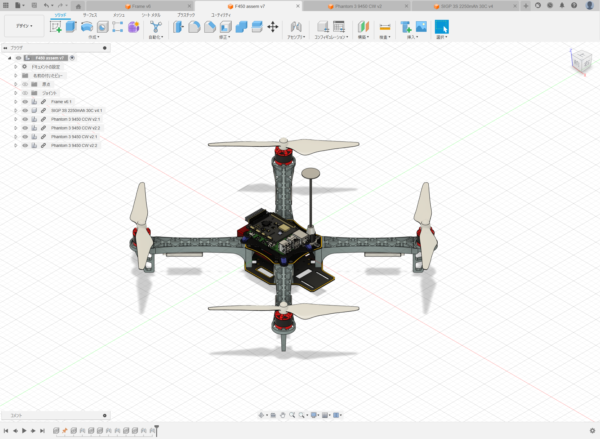
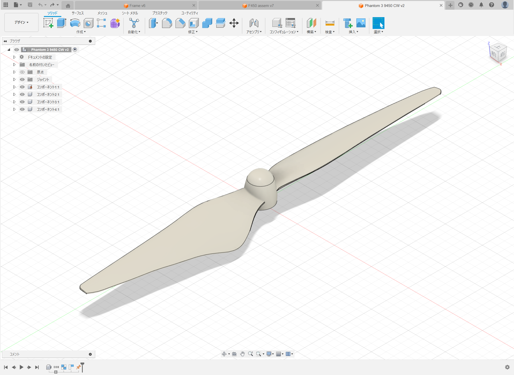
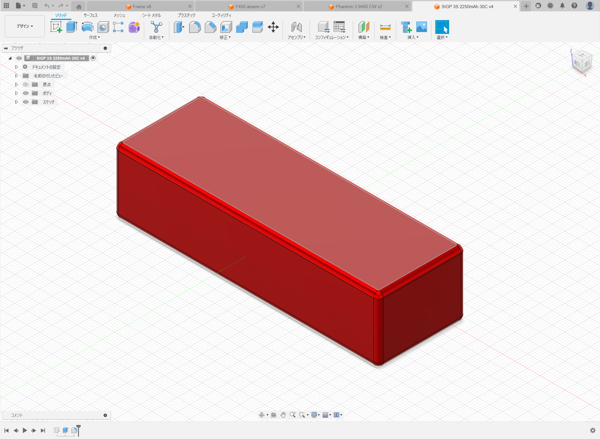
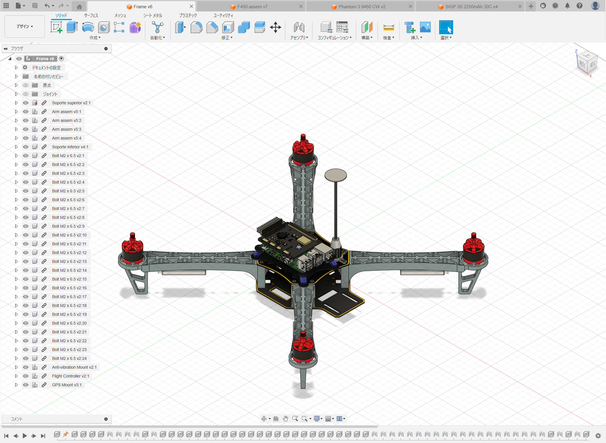

# 3D Modeling of the Drone

Creating a detailed 3D model of your drone is a crucial step in simulation and control.
Here's a comprehensive guide on how to approach this using Autodesk Fusion 360.

## Key Considerations for Selecting Drone Components

---

When selecting components for the drone, pay attention to the following:

### ESC

- Choose an ESC that can handle PWM (Pulse Width Modulation) signals from 1000us to 2000us.
- BLHeli firmware is recommended for its reliability and performance.

### Propeller

- Opt for propellers with well-documented aerodynamic characteristics for enhanced control.
- Use a thrust measuring device like the
  <a href=https://www.tytorobotics.com/pages/series-1580-1585 target="_blank">Series 1585 Thrust Stand</a>
  or select propellers with data available on the
  <a href=https://m-selig.ae.illinois.edu/props/propDB.html target="_blank">UIUC Propeller Data Site</a>.

### RC Receiver

- Ensure the RC receiver is compatible with S.BUS and supports at least 8 channels.
- In this tutorial, the
  <a href=https://www.amazon.co.jp/UltraPower-Corona-R8SF-S-BUS-S-FHSS/dp/B087YZYN9W target="_blank">Corona R8SF</a>
  is used.

### RC Transmitter

- The RC transmitter must be compatible with the receiver's protocol.
- The <a href=https://www.rc.futaba.co.jp/products/detail/I00000006 target="_blank">Futaba T10J</a>,
  supporting S-FHSS (used by R8SF) and T-FHSS AIR for bidirectional communication, is chosen for this tutorial.

## Guidelines for Effective Modeling

---

When engaging in modeling, consider these important aspects:

### 1. Model Each Rigid Body Individually

In URDF, which is used for representing robots and drones, every multi-link rigid body system must be modeled.
At the very least, each rigid body requires its own model.
However, URDF's flexibility allows for the division of a single rigid body into several parts using fixed joints.

### 2. Align Model Axes with the Drone's Base Coordinate System

For simplicity in creating URDF and for clearer understanding during operation,
align each model's axes with the drone's base coordinate system.
The recommended alignment is with the NWU coordinate system (where X is forward, Y is left, and Z is up),
commonly used in Gazebo, a physics simulator.

### 3. Assign Materials to Each Model for Accurate Mass Properties

When the material of a part is unknown or varies (like in a motor), you might need to use these approaches:

1. Determine the average density by calculating it from the model's actual mass and assign a virtual material with this density.
2. For parts with indeterminate materials, treat them as separate links and estimate their mass properties.
   Use basic shapes (like boxes, spheres, or cylinders) and mass values when building the URDF.

### 4. Exact Model Precision is Not Critical

Control systems can tolerate some inaccuracies in modeling.
Thus, the mass properties of your model don’t need to be perfectly precise.
Aim to closely match the model with the actual drone,
but remember that a variation of up to 50% in mass properties is unlikely to drastically impact stability.
For example, you can exclude minor components like the RC receiver or cables from the model, as demonstrated in this tutorial.

## Modeling a Quadcopter

---

This section outlines the process of modeling a quadcopter using the F450 Frame Kit, as shown in the provided assembly image.
The modeling approach is in line with the previously outlined guidelines.

Consistent with guideline 1, the quadcopter is segmented into six distinct models representing its rigid bodies:
four propellers, one battery, and the frame assembly.

### Modeling the Propellers

The propellers used are Phantom3 9450 models.
These are sourced from <a href=https://grabcad.com target="_blank">GrabCAD</a> and imported into Fusion 360.
Each propeller is aligned with its rotational axis along the Z-axis and set to be made of ABS material.
The modeled propellers approximate the actual propellers' mass at around 10g,
a process done for both clockwise and counter-clockwise propellers.

### Modeling the Battery

The battery modeled is a
<a href=https://www.amazon.com/Battery-2250mAh-Airplane-Quadcopter-Helicopter/dp/B08SVQH2H1?ref_=ast_sto_dp target="\_blank">
SIGP 3S 2250mAh 30C</a>.
Despite being fixed to the frame, it's modeled separately to accommodate potential future replacements.
Without a ready-made model on GrabCAD, a simple rectangular shape with fillets is created.
The battery is aligned with the NWU coordinate system, and due to its non-uniform and unknown material,
no specific material is set in the CAD, adhering to alternative approach 2 from guideline 3.

### Modeling the Frame

The frame model encompasses all parts except the propellers.
A STEP file for the frame is obtained from GrabCAD and imported into Fusion 360.
Additional components, such as the GPS mount and the Raspberry Pi 4B + Navio2 flight controller, are also incorporated.
The assembly aligns with the NWU coordinate system.
Materials for each part are assigned accordingly, with uniform materials for arms and bolts,
and virtual materials for parts like motors and ESCs, following alternative approach 1 from guideline 3.
The total mass of this assembly is about 635g, closely resembling the actual frame's mass.

### Exporting Mesh Files and Properties

Mesh files for each model are exported.
Key information, such as origin positions and mass properties around these origins, is noted.
As the modeling is conducted on Windows via Fusion 360, and subsequent operations are on Ubuntu,
these files are uploaded to a cloud service like Google Drive for easy access across different operating systems.
