# Tobas Setup Assistant

The Tobas Setup Assistant is a GUI tool designed for creating configuration files needed to operate drones with Tobas.
It utilizes the URDF created in the previous steps and allows for the configuration of elements not expressed in the URDF,
such as propeller aerodynamics and controller settings.

## Creating a Catkin Workspace

---

To use Tobas with your drone, you need to create a ROS package containing all necessary configuration files.
This requires a catkin workspace, which can be set up with the following commands:

```bash
$ mkdir -p ~/catkin_ws/src
$ cd ~/catkin_ws
$ catkin init
```

Feel free to replace `catkin_ws` with any name of your choice.

## Launching the Setup Assistant and Loading the URDF

---

Start the Tobas Setup Assistant using following command in the terminal:

```bash
$ roslaunch tobas_setup_assistant setup_assistant.launch
```

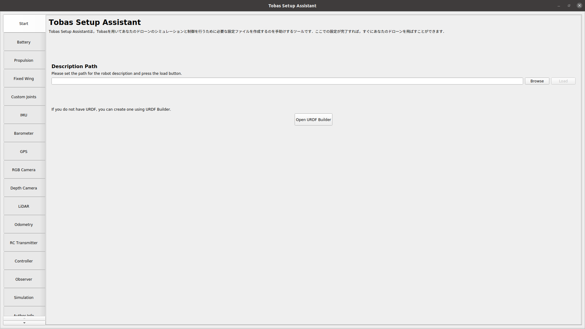

To load your URDF, click `Browse`, select your file, and then click `Load`.
The URDF's link names will appear in a tree structure under `Frames Tree` on the screen's top left.
Selecting a link will highlight it in the central model view.
Movable joint names are displayed on the top right,
and adjusting the sliders will change the corresponding joint angles in the model view.

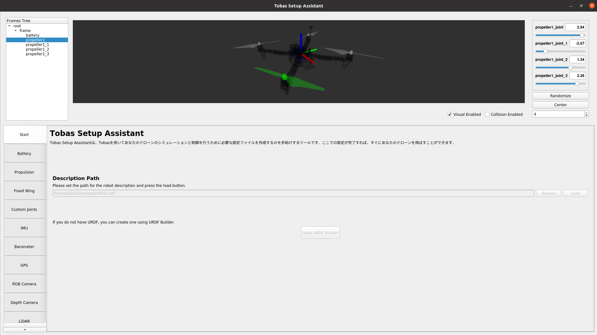

Once the URDF is loaded, tabs on the left side of the screen become active for configuration.

## Battery

---

Input the specifications of your drone's battery in the battery settings tab.

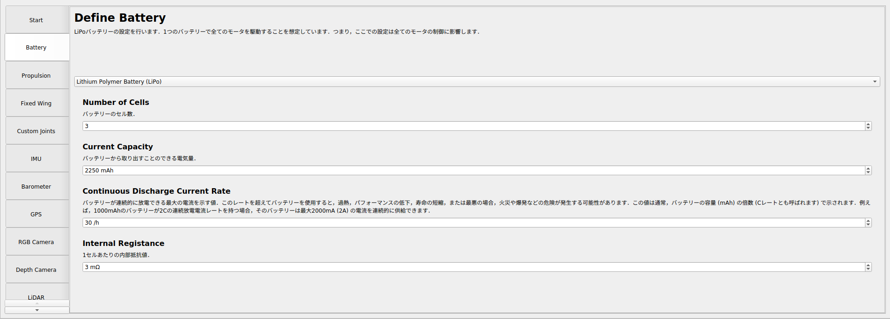

## Propulsion System

---

This section involves configuring the propellers.
`Available Links` list shows links that can be designated as propellers.
If a necessary link does not exist in the list, check if its joint type in the URDF Builder is set to `Continuous`.

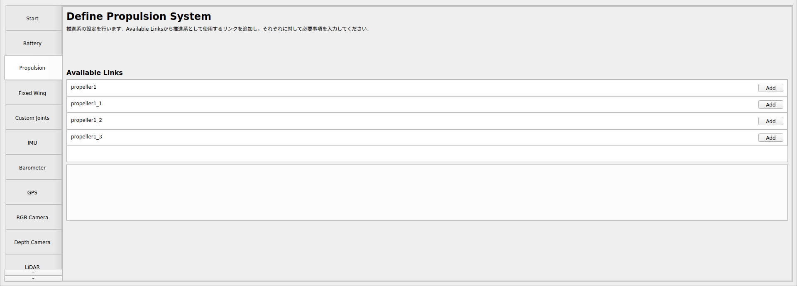

Click `Add` next to a link name to visualize the thrust direction as an arrow in the model view
and to open a settings tab for that propeller.
If the thrust direction appears incorrect, adjust the Axis in URDF Builder.

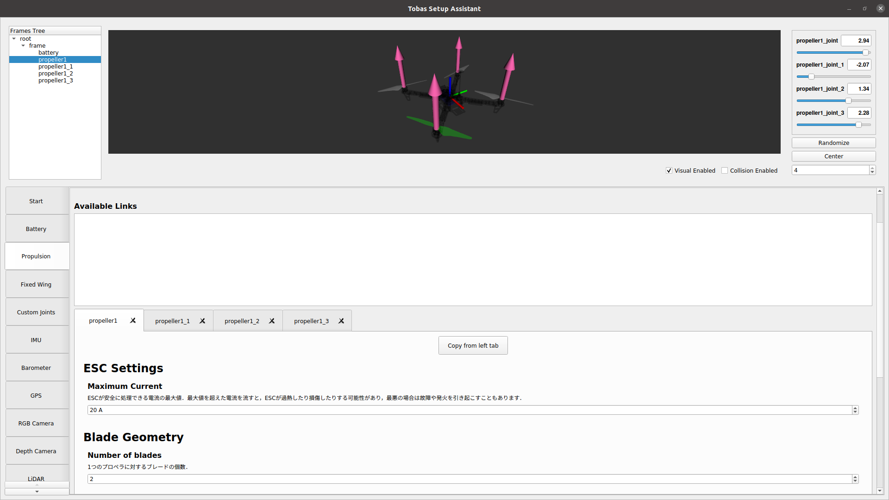

For `propeller1`, input the relevant values in `ESC Settings` and `Blade Geometry` as per the spec sheet.

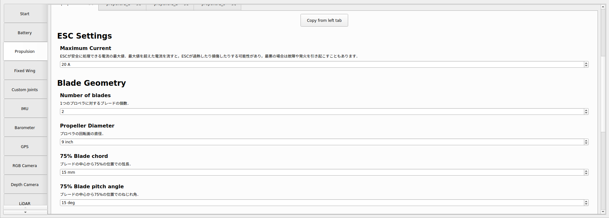

In `Motor Settings`, set up the motor dynamics.
If you don't have experimental data for your motor with the propeller,
select `Set from motor spec` and input values based on the spec sheet.

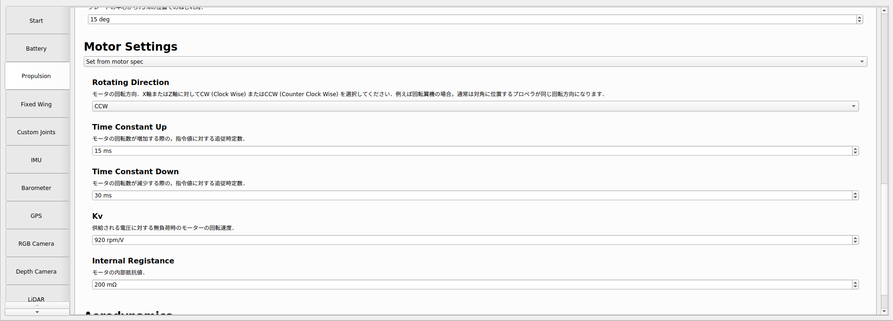

Configure the aerodynamic characteristics of the propeller in `Aerodynamics`.
For accuracy, Set from blade geometry is not recommended. Use `Set from UIUC propeller data site` instead.
<a href=https://m-selig.ae.illinois.edu/props/propDB.html target="_blank">UIUC Propeller Data Site</a>
is a compilation of experimental aerodynamic data for various propellers.
For example, if using an APC propeller, most models' data can be found there.
However, as the data for the Phantom3 0945 propellers used here is not available, we will use the data for
<a href=https://m-selig.ae.illinois.edu/props/volume-1/data/apcsf_9x4.7_static_kt1032.txt target="_blank">APC 9 x 4.7</a>
from UIUC's Volume 1 as a substitute. Transcribe the static data into the table.

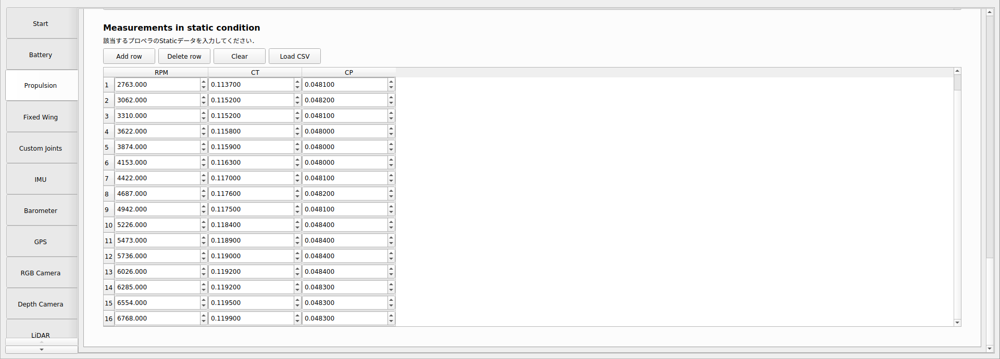

You can also create a CSV file like the one below and load it using `Load CSV`:

```csv
RPM,CT,CP
2763,0.1137,0.0481
3062,0.1152,0.0482
3310,0.1152,0.0481
3622,0.1158,0.0480
3874,0.1159,0.0480
4153,0.1163,0.0480
4422,0.1170,0.0481
4687,0.1176,0.0482
4942,0.1175,0.0481
5226,0.1184,0.0484
5473,0.1189,0.0484
5736,0.1190,0.0484
6026,0.1192,0.0484
6285,0.1192,0.0483
6554,0.1195,0.0483
6768,0.1199,0.0483
```

Configure the remaining three propellers similarly.
Since their settings are identical except for the rotation direction,
you can copy the settings from one propeller to the others.
Use the `Copy from left tab` button at the top of each tab to duplicate settings.
Ensure the settings from `propeller1` are correctly applied to the others and adjust the `Rotating Direction` for each.
If you're unsure about which link corresponds to which position on the drone,
use the highlight feature in the `Frames Tree` for clarification.

## Fixed Wing

---

This section is for configuring fixed-wing aircraft settings.
Since we're working with a rotary-wing aircraft in this example, we'll skip this step.

## Custom Joints

---

Here, you can configure any movable joints that are not part of the propulsion system or fixed-wing surfaces. In our current setup, as there are no movable joints besides the propellers, we will skip this step.

## Onboard Sensors (IMU, Barometer, GPS)

---

The integrated 9-axis IMU, barometer, and GPS are part of the flight controller.
While the default settings are typically sufficient,
we will adjust the GPS offset in this instance to account for the GNSS receiver's location, which is away from the root frame.

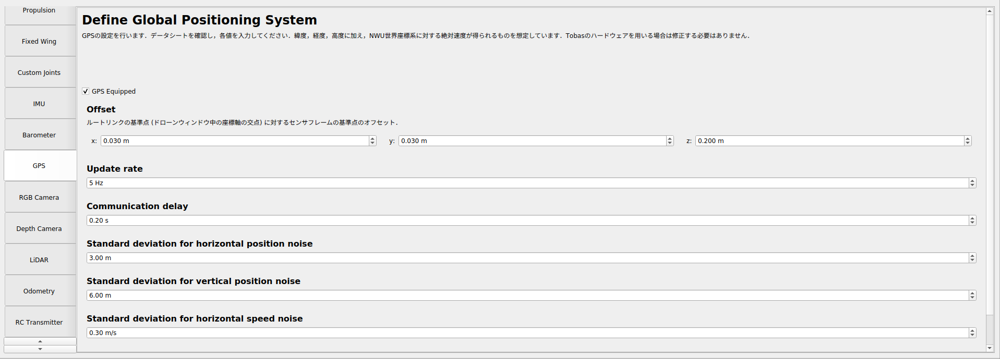

## Additional Sensors (Camera, LiDAR, Odometry)

---

This section is for setting up any additional equipment that publishes camera, LiDAR, or odometry data.
As our current drone setup does not include these devices, we'll skip this part.

## RC Transmitter

---

Configure the settings for the remote control transmitter.
In this example, set `The number of flight modes` to 2.

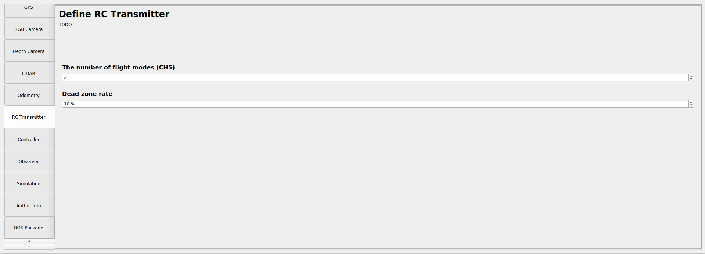

## Controller

---

In this section, you'll configure the controller settings.
Upon opening the combo box, you'll see a list of available controllers.
For our purposes, select `Multirotor PID`.
The `Flight Modes` displayed should correspond to the number you set in the `RC Transmitter` tab.
Assign `Flight Mode 1` as `RollPitchYawThrust` and `Flight Mode 2` as `PosVelAccYaw`.

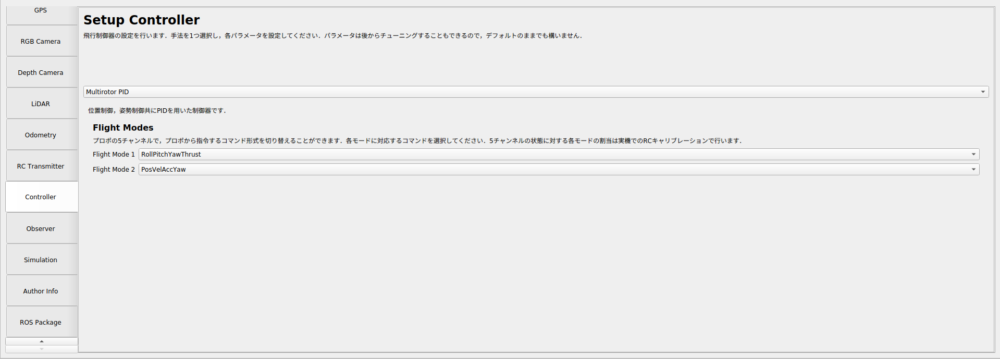

## Observer

---

Set up the state estimator settings here.
The default configurations are usually adequate for most use cases.

## Simulation

---

Configure the settings for the Gazebo simulation environment.
`Gravity` is set to the standard gravitational acceleration by default.
The default latitude, longitude, and altitude correspond to the Geodetic origin of Japan and the Japan Vertical Datum.
These settings are not critical for our current setup, so we'll maintain them as they are.

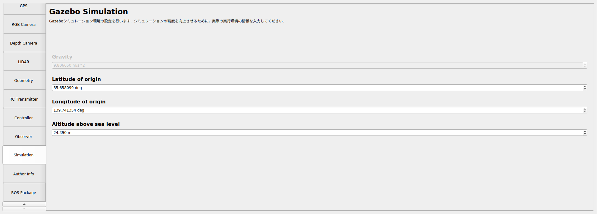

## Author Infomation

---

Enter the name and email address of the person administering the Tobas package that you're creating with the Setup Assistant.
This step is important for keeping track of package ownership and for any necessary future communications.

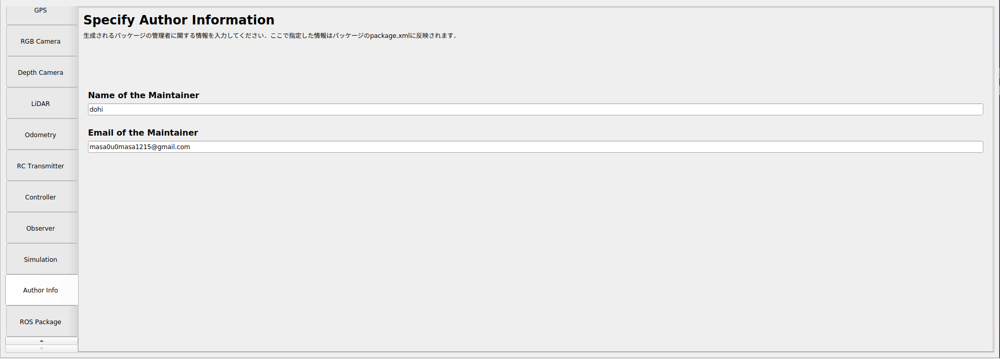

## ROS Package

---

This section is for setting up the directory and name for the Tobas package you're generating.
Set the `Parent Directory` to the `src/` directory within your catkin workspace.
Choose an appropriate name for your package and enter it in the `Package Name` field.
Once you click the `Generate` button, the Tobas package will be created in the specified directory,
and the Setup Assistant will close automatically.

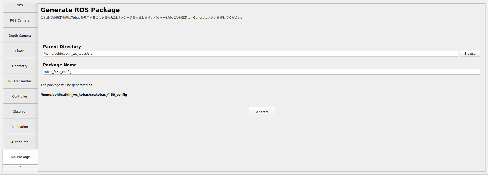

## Building the Tobas Package

---

After generating the Tobas package, you need to build it within your catkin workspace.
Navigate to your workspace directory and use the following commands to build the Tobas package:

```bash
$ cd ~/catkin_ws
$ catkin build tobas_f450_config
```

This final step compiles and integrates the package into your ROS environment, making it ready for use with your drone setup.
With this, the configuration process using the Tobas Setup Assistant is complete,
and your drone should now be properly set up with all the necessary configuration files for operation.
